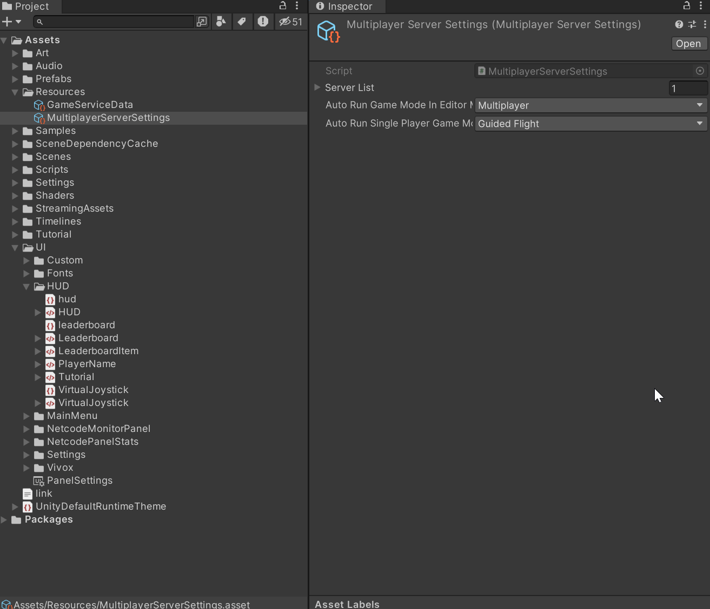

## Contents and Quick Links

- [Contents and Quick Links](#contents-and-quick-links)
- [Megacity Multiplayer Overview](#megacity-multiplayer-overview)
- [Megacity Multiplayer Prerequisites](#megacity-multiplayer-prerequisites)
  - [Recommended Specs for Mac](#recommended-specs-for-mac)
  - [Recommended Specs for Windows 10](#recommended-specs-for-windows-10)
- [Important Note Before You Begin](#important-note-before-you-begin)
- [Get Megacity Multiplayer](#get-megacity-multiplayer)
  - [Clone the Project](#clone-the-project)
- [Get Started](#get-started)
- [Add Unity Gaming Services (UGS)](#add-unity-gaming-services-ugs)
  - [Game Server Hosting (Multiplay)](#game-server-hosting-multiplay)
  - [Matchmaker](#matchmaker)
  - [Vivox](#vivox)
- [Test Your Multiplayer Setup](#test-your-multiplayer-setup)
  - [Editor Local Multiplayer Setup (Without UGS)](#editor-local-multiplayer-setup-without-ugs)
  - [Build Local Multiplayer Setup (Without UGS)](#build-local-multiplayer-setup-without-ugs)
- [Gameplay Controls](#gameplay-controls)
  - [Mouse and Keyboard](#mouse-and-keyboard)
- [Index of Resources in this Project](#index-of-resources-in-this-project)
  - [Gameplay](#gameplay)
  - [Audio](#audio)
  - [Connectivity](#connectivity)
  - [Services (Vivox, Matchmaker, etc.)](#services-vivox-matchmaker-etc)
  - [UI](#ui)
  - [Tools and Utilities](#tools-and-utilities)
- [Troubleshooting](#troubleshooting)
  - [Bugs](#bugs)
- [Disclaimer](#disclaimer)
- [License](#license)

## Megacity Multiplayer Overview

Megacity Multiplayer is an action-packed, shooter game based on the original Megacity sample. It leverages the power of Netcode for Entities for an immersive, multiplayer experience that can support 64+ players simultaneously. The latest DOTS packages and Unity Gaming Services (UGS) enhances the Megacity Multiplayer user experience. Megacity Multiplayer showcases how to create engaging and immersive multiplayer experiences with a suite of netcode and multiplayer tools, tech, and services. 

Some important points of this demo are:
- Large-scale streaming and rendering with the Entity Component System (ECS for Unity)
- 64+ players per game session
- Server-authoritative gameplay with feature prediction, interpolation, and lag compensation using Netcode for Entities
- Unity Gaming Services (UGS) integration for Game Server Hosting, Matchmaking, and Vivox voice chat
- High Definition Render Pipeline (HDRP)
- Cross-platform support for Windows and Mac

## Megacity Multiplayer Prerequisites

Megacity Multiplayer is compatible with Unity **2022 LTS** and is currently tested on Windows and Mac. 
You can download the editor using the following link:
- Unity Website: [Download Unity LTS](https://unity.com/releases/lts)

### Recommended Specs for Mac
- Operating System: Mac OS X 10.15.7
- CPU: Intel(R) Core(TM) i7-9750H CPU @ 2.60GHz
- RAM: 32GB
- GPU: AMD Radeon Pro Vega 20
- Storage: 20GB

### Recommended Specs for Windows 10
- Operating System: Windows 10 64bit
- CPU: Intel(R) Core(TM) i7-9750H CPU @ 2.60GHz
- RAM: 32GB
- GPU: NVIDIA GeForce GTX 1650 with Max-Q Design
- Storage: 20GB

## Important Note Before You Begin

The Megacity Multiplayer sample is large, so the **first time** cloning and playing the sample may take more time than expected. Subsequent plays should load much quicker because of caching.

First time clone and load time estimates:
- Cloning the Megacity Multiplayer repo: Up to 20 min
- Opening the project with library build: Up to 20 min
- When going into the main scene, subscenes need to import: Up to 20 min
- When going into the playmode, server world is created: Up to 30 min

## Get Megacity Multiplayer

To get the Megacity Multiplayer sample, you can clone the project using Git. **Please note that direct download of the project is not currently supported for this repository**.

### Clone the Project

Before you can clone the project, you must install Git Large File Support (LFS). Megacity Multiplayer uses Git LFS to handle all large assets required locally. Refer to [Git LFS installation options](https://github.com/git-lfs/git-lfs/wiki/Installation) for instructions on Windows and Mac. 

## Get Started

After you clone the project, follow these steps to start playing:
1. Install a compatible Unity Editor version. During install make sure to include Standalone Support and Dedicated Server Support and Build Support (IL2CPP) for Windows/Mac.
2. To add the project to the **Unity Hub**, click the **Add** button and select the root folder of the cloned project.
	- **Note**: The first time you open the project may take longer than usual because Unity is importing all the assets.
3. Prior to entering playmode, it may be necessary to create the Entities scene cache. To achieve this, please open Main scene located in `Scenes/Main.scene`.
  - **Important**: To monitor the progress of the Entities scene cache loading, navigate to Window > General > Process. This action will open the Background Tasks Window, displaying a loading bar.
  
3. When all subcenes has been created, open the Menu scene located in `Scenes/Menu`. 
4. Click the **Play** button to start.

## Main Menu

The main menu offers the following options:
1. **Single Player**
  - *Guided Flight:* This mode enables automatic navigation through the city using Cinemachine path to establish the route.
  - *Free Flight:* In this game mode, you can drive a vehicle and explore the entire city at your own pace.

2. **Multiplayer**, in the "Mode" radio button, you can choose from the following options:
  - [Matchmaking](#matchmaker)
  - [Connect](#connect)

3. **Settings**, it is possible to find the option to configure the game settings based on the hardware to enhance your overall gaming experience. This option is also available in the Main scene at runtime.

## Run Main scene directly

Within the `Resources` directory, it is possible to find an asset named `MultiplayerServerSettings`. 
This asset allows to configure the Server List that appears in the Menu.
Furthermore, there are supplementary options available:

1. *Auto Run Game Mode In Editor Main:* This option lets you choose between running the main scene directly in Singleplayer or Multiplayer mode, bypassing the Menu scene.
2. *Auto Run Single Player Game Mode In Editor Main:* The availability of this option depends on the selection of "Auto Run Game Mode In Editor Main" as "Single Player."

## Add Unity Gaming Services (UGS)

Megacity Multiplayer uses several services from UGS to facilitate connectivity between players. To use these services inside your project, you need a [Unity Account](https://docs.unity.com/ugs-overview/en/manual/creating-unity-ids) and [create an organization](https://support.unity.com/hc/en-us/articles/208592876-How-do-I-create-a-new-Organization-) within the Unity Dashboard.

You can still use Megacity Multiplayer without UGS, but for a better multiplayer experience, it is recommended to use the following services:

### Game Server Hosting (Multiplay)

**Game Server Hosting**, formerly known as Multiplay, is a robust and flexible infrastructure for hosting multiplayer games. It ensures a smooth operation of your game by delivering proven performance and scalability. With Game Server Hosting, you can launch your multiplayer titles with confidence, knowing that you have the support of a reliable global platform. The enables you to spend less time troubleshooting and more time building your game with the help of comprehensive documentation, samples, and software development kits (SDKs) designed for interoperability. To get started with Game Server Hosting, refer to the official [documentation](https://docs.unity.com/game-server-hosting/en/manual/guides/get-started).

**Warning**: Game Server Hosting is a pay-as-you-go service with a free tier. You must sign up for UGS services with a credit card to start using Game Server Hosting. If you exceed the [free tier usage allowance](https://unity.com/solutions/gaming-services/pricing), you will be charged. See our [Billing FAQ](https://support.unity.com/hc/en-us/articles/6821475035412-Billing-FAQ) to learn more.

To use Game Server Hosting in your project, you need to [Integrate the Game Server Hosting](https://docs.unity.com/game-server-hosting/manual/guides/get-started#Integrat) service from the [Unity Dashboard](https://dashboard.unity3d.com/multiplay).

**Note**: You must be an Owner or Manager of your organization to enable Game Server Hosting.

After you integrate Game Server Hosting, you must create a [build](https://docs.unity.com/game-server-hosting/manual/guides/get-started#Create), a [build configuration](https://docs.unity.com/game-server-hosting/manual/guides/get-started#Create2), a [fleet](https://docs.unity.com/game-server-hosting/manual/guides/get-started#Create3), and a [test allocation](https://docs.unity.com/game-server-hosting/manual/guides/get-started#Create4).

**Tip**: Check out our YouTube video [How to set up Game Server Hosting](https://www.youtube.com/watch?v=oN2c9teXi7M).

For Megacity Multiplayer, we use the following Game Server Hosting configuration:

- **Launch parameters**: `-ip $$ip$$ -port $$port$$ -queryport $$query_port$$ -logFile $$log_dir$$/$$timestamp$$-Engine.log`
- **Servers per machine**: 3 (Server requires approximately 1500 MHz CPU Speed and 1600 MB Memory. 3 servers per machine will equate to each server having approximately 1700 MHz CPU and 2600 MB Memory)

### Matchmaker

**Matchmaker** is a versatile tool that enables you to customize matches in your game. It offers fast and efficient matches, multi-region orchestration, and backfill options. With its flexible configuration, dynamic scalability, and robust rule engine, Matchmaker simplifies matchmaking while supporting complex game loops. For more information, consult the [Matchmaker Quick Start Guide](https://docs.unity.com/matchmaker/en/manual/matchmaker-quick-start).

To use Matchmaker in your project, you must **Enable** and **Integrate** the Matchmaker service from the [Unity Dashboard](https://dashboard.unity3d.com/matchmaker).

For Megacity Multiplayer, we use the following Matchmaker configuration:

Creating the [queue](https://docs.unity.com/matchmaker/en/manual/advanced-topics-queues-pools#Queues):
- **Maximum players on a ticket**: 12

Creating a default [pool](https://docs.unity.com/matchmaker/en/manual/advanced-topics-queues-pools#Pools):
- **Timeout**: 60 seconds

For Matchmaker [rules](https://docs.unity.com/matchmaker/manual/matchmaking-rules-rules), we use the following configuration:
- **Backfill enabled**: true 
- **Team count min**: 1
- **Team count max**: 1
- **Player count min**: 64
- **Player count max**: 256
- **Relaxation 1**: Replace youngest, Replacement value: 32, at seconds: 5
- **Relaxation 2**: Replace youngest, Replacement value: 1, at seconds: 10

After configuring the services on the dashboard website, navigate to **Edit > Project Settings > Service** and choose your organization and project ID.

Next, click on the play button to initiate the game. To access the Matchmaking services, navigate to the main menu and select **"Matchmake"** from the radio button menu, followed by clicking the **"Find Match"** button.

Once the "Find Match" button is clicked, the Matchmaking services will initiate the connection process with the server. During this time, a circular loading indicator will be presented to signify that the system is in the process of establishing the connection. Once the connection is established, you will be able to start gameplay.

### Vivox

**Vivox** is a voice chat service that enables players to communicate with each other in-game. To use [Vivox](https://unity.com/products/vivox), you need to connect your project to Vivox from the Unity Editor and enable Vivox in the [Unity Dashboard](https://dashboard.unity3d.com/vivox.).

For more information about Vivox, and how to use it you can read the [Vivox quickstart guide](https://docs.vivox.com/v5/general/unity/15_1_200000/en-us/Default.htm#Unity/vivox-unity-first-steps.htm).
  
## Test Your Multiplayer Setup

Megacity Multiplayer is server-authoritative, which means the server has ultimate authority and control over the game's state and rules. To test the game, a server needs to be running, and clients need to connect to the server. This can be done in the Editor, locally, or through Game Server Hosting (Multiplay).

---------------

### Connect
### Editor Local Multiplayer Setup (Without UGS)

For testing purposes, you can run the Client and Server in the Editor. This enables inspection of entities, systems, components, etc. while running on both the Server and Client.

To set up the Editor for local multiplayer:
1. Go to **Project Settings** > **Entities**. 
2. Set the **NetCode Client Target** to `ClientAndServer`.
3. Open Multiplayer PlayMode Tools from **Multiplayer** > **Window: PlayMode Tools**. 
4. Set the **PlayMode Type** to `Client & Server`.

In the **Assets > Settings > Gameplay > MultiplayerServerSettings**, you have the ability to configure a server list that will be presented in the play mode Main menu window. This functionality allows for the establishment of multiple connections and facilitates the use of the Default IP connection.

To begin, click the play button in the Unity Editor to launch the game. Once the game is running and you are in the Main Menu, navigate to the **Connect** option in the radio button menu. From the **drop-down box**, select the desired IP address to establish a connection. If the desired IP address is not available in the list, you have the option to create a new entry and re-enter play mode. Alternatively, you can manually enter your own IP address using the provided text field.

By default, the project is configured to use the **Local** IP address. If you are testing the game in the Editor, selecting the Local IP option will allow you to run both the server and client within the Editor, enabling you to play the game.

Once you have selected the appropriate IP address, click the **Connect** button to initiate the connection process.

Now, when you play the game from the Editor, the Server and Client run together on your local machine. To inspect Client or Server entities, systems, etc., you can use the Entities window (**Window** > **Entities**). For example, if you open **Entities Hierarchy**, you can select the desired **World** to inspect from the dropdown. See the following image:

---------------

### Build Local Multiplayer Setup (Without UGS)

To build your game and test it locally, you need to build the Client and Server separately.

To make a Client Build:
1. In the Editor, go to **Project Settings** > **Entities** to change the **NetCode Client Target** to `Client`.
2. Like any other Unity game, make the build by going to **File** > **Build Settings**.
3. Enable the `Megacity` scene and set the target platform is `Windows, Mac, Linux`.
4. Press the **Build** button.

To make a Server Build:
1. Set the target platform to **Dedicated Server**.
2. Like the Client build, go to **File** > **Build Settings** and press the **Build** button.

---------------

## Gameplay Controls

### Mouse and Keyboard

| Input        | Action       |
|--------------|--------------|
| Mouse Movement / Arrow Keys | Steering |
| Left Click / Space | Shoot |
| W/S | Thrust / Reverse |
| A/D | Steering |
| E/Q | Roll |
| Tab | Settings |
| V | Toggle Vivox |
| P | Netcode Panel Stats |
| No Key Press | Auto-Level |

## Index of Resources in this Project

### Gameplay
- [Vehicle Input System](Assets/Scripts/Gameplay/Player/PlayerVehicleInputSystem.cs)
- [PlayerVehicleJobs](Assets/Scripts/Gameplay/Player/Jobs/PlayerVehicleJobs.cs)
- [SetupPlayerInfoSystem](Assets/Scripts/Gameplay/Player/SetupPlayerInfoSystem.cs)
- [ShootingSystem](Assets/Scripts/Gameplay/Shooting/ShootingSystem.cs)
- [BoundSystem](Assets/Scripts/Gameplay/Misc/BoundsSystem.cs)
- [SpawnPoint](Assets/Scripts/Gameplay/Misc/MonoBehaviours/SpawnPoint.cs)
- [UpdatePlayerRankSystem](Assets/Scripts/Gameplay/Player/UpdatePlayerRankSystem.cs)

### Audio
- [SoundPoolSystem](Assets/Scripts/Gameplay/Audio/SoundPoolSystem.cs)
- [AudioMaster](Assets/Scripts/Gameplay/Audio/MonoBehaviours/AudioMaster.cs)

### Connectivity
- [NetcodeBootstrap](Assets/Scripts/Gameplay/Netcode/NetcodeBootstrap.cs)

### Services (Vivox, Matchmaker, etc.)
- [VivoxManager](Assets/Scripts/Gameplay/Vivox/MonoBehaviours/VivoxManager.cs)
- [ClientMatchmaker](Assets/Scripts/UGS/Client/ClientMatchmaker.cs)
- [GameServerManager](Assets/Scripts/UGS/Server/GameServerManager.cs)

### UI
- [HUD](Assets/Scripts/Gameplay/UI/MonoBehaviours/HUD/HUD.cs)
- [MainMenu](Assets/Scripts/Gameplay/UI/MonoBehaviours/MainMenu/MainMenu.cs)
- [UIGameSettings](Assets/Scripts/Gameplay/UI/MonoBehaviours/Settings/UIGameSettings.cs)

### Tools and Utilities
- [NetcodeExtensions](Assets/Scripts/Utils/NetcodeExtensions)
- [NetcodePanelStats](Assets/Scripts/Utils/NetcodeExtensions/UI/NetcodePanelStats.cs)
- [KDTree](Assets/Scripts/Utils/KDTree)
- [Pooling](Assets/Scripts/Utils/Pooling)

## Troubleshooting

### Bugs

Report bugs in Megacity Multiplayer using GitHub [issues](https://github.com/Unity-Technologies/MegacityMultiplayer/issues). If the bugs are related to the Entities packages, use the Entities GitHub issues.

## Disclaimer

This repository does not accept pull requests, GitHub review requests, or any other GitHub-hosted issue management requests.

## License

Megacity Multiplayer is licensed under the Unity Companion License. See [LICENCE](LICENCE.md) for more legal information.
